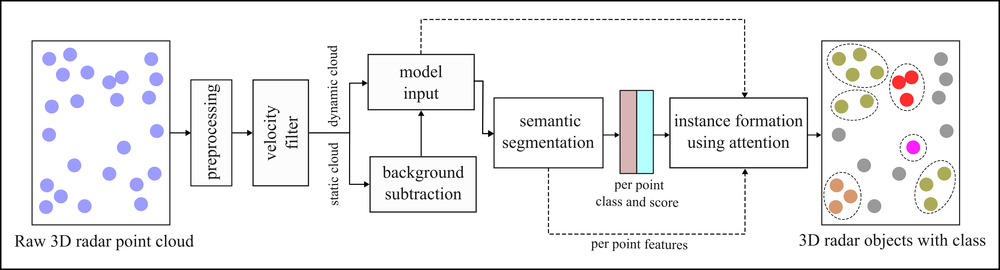

<div align="center">

# Deep Segmentation of 3+1D Radar Point Cloud for Real-Time Roadside Traffic User Detection

<u>[Savankumar Bhanderi](https://www.linkedin.com/in/savankumarbhanderi)</u><sup>1,<a href="mailto:savankumar.bhanderi@thi.de?subject=RoadsideRadar" style="color: #4799e0; text-decoration: underline;">📧</a></sup>,&nbsp; <u>[Shiva Agrawal](https://www.linkedin.com/in/shiva-agrawal-06562510a/)</u><sup>1</sup>,&nbsp; <u>[Gordon Elger](https://www.linkedin.com/in/gordon-elger-48a658/)</u><sup>1</sup>

<sup>1</sup><u>[Technische Hochschule Ingolstadt](https://www.thi.de/en/research/institute-of-innovative-mobility-iimo/research-areas/sensor-technology-and-sensor-data-fusion/)</u>

<i><span style="color: black;">Springer Nature Scientific Reports 2025 </span></i>

[](https://www.nature.com/articles/s41598-025-23019-6)&nbsp;&nbsp; 
[](https://doi.org/10.5281/zenodo.19056521)&nbsp;&nbsp;
[](https://opus4.kobv.de/opus4-haw/frontdoor/index/index/searchtype/simple/query/%2A%3A%2A/browsing/true/doctypefq/masterthesis/docId/5145/start/8/rows/50)
</div>

## Introduction
This paper proposes a deep learning-based 3 + 1 D radar point cloud clustering methodology tailored for smart infrastructure-based perception applications. This approach first performs semantic segmentation of the radar point cloud, followed by instance segmentation to generate well-formed clusters with class labels using a deep neural network. It also detects single-point objects that conventional methods often miss. The described approach is developed and experimented using a smart infrastructure-based sensor setup and it performs segmentation of the point cloud in real-time.

<p align="center">

</p>

</div>

---

## Dataset
Along with the deep learning algorithm, the RoadsideRadar dataset is also provided in this paper. Please visit official [zenodo](https://doi.org/10.5281/zenodo.19056521) webpage to access the dataset. The code in this repository expects the same structure of dataset as provided in the zenodo. For more information, please read [dataset.md](docs/dataset.md) 

## Environment Setup
To dependency conflicts, we recommend using a **Conda** virtual environment. This project is tested for *Python 3.8.10*.

### 1. Clone the Repository
Open your terminal and clone the project to your local machine:
```bash
git clone https://github.com/bhanderisavan/roadside-radar-seg.git
cd roadside-radar-seg
```

### 2. Create the Conda Environment
```bash
conda create -n radar_seg python=3.8.10 -y
conda activate radar_seg
```

### 3. Install Dependencies
```bash
conda install pip -y
pip install -r requirements.txt
```
---
## Training

```bash
cd /path/to/roadside-radar-seg
conda activate radar_seg
python3 train_cli.py --config "experiments/config.yaml" --checkpoint 10 --batch 64 --device "cpu"
```
---
## Evaluation
---
## Inference 

---
## License

The data set is licensed under Creative Commons Attribution Non Commercial Share Alike 4.0 International (https://creativecommons.org/licenses/by-nc-sa/4.0/legalcode). Hence, the data set must not be used for any commercial use cases.

---
## Funding

This work was supported by the Bavarian Ministry of Economic Affairs, Regional Development and Energy (StMWi), Germany within the Project “InFra — Intelligent Infrastructure.”

## Citation

If our work has contributed to your research, we would appreciate citing our [paper](https://www.nature.com/articles/s41598-025-23019-6) and giving the [Github](https://github.com/bhanderisavan/roadside-radar-seg) repository a star.

```
@article{bhanderi2025radar,
title={Deep segmentation of 3+1D radar point cloud for real-time roadside traffic user detection},
author={Bhanderi, S. and Agrawal, S. and Elger, G.},
journal={Scientific Reports},
volume={15},
pages={38489},
year={2025},
doi={10.1038/s41598-025-23019-6}
}
```
```
@dataset{bhanderi_2025_19056521,
author={Bhanderi, Savankumar andAgrawal, Shiva and Elger, Gordon},
title={RoadsideRadar: A Roadside 3+1D Automotive RadarPoint Cloud Dataset for Semantic and Instance Segmentation},
month=march,
year=2025,
publisher={Zenodo},
version={1.0},
doi={10.5281/zenodo.19056521},
url={https://doi.org/10.5281/zenodo.19056521},
}
```

## Contact

For questions, collaborations, or dataset/code access updates, please contact:  

**Savankumar Bhanderi**  

- **Email:** [savankumar.bhanderi@thi.de](mailto:savankumar.bhanderi@thi.de)  
- **GitHub:** [https://github.com/bhanderisavan](https://github.com/bhanderisavan)  
- **ORCID:** [https://orcid.org/0000-0001-7257-6736](https://orcid.org/0000-0001-7257-6736)  
- **Google Scholar:** [link](https://scholar.google.com/citations?user=p0775gsAAAAJ&hl=de&authuser=1)
